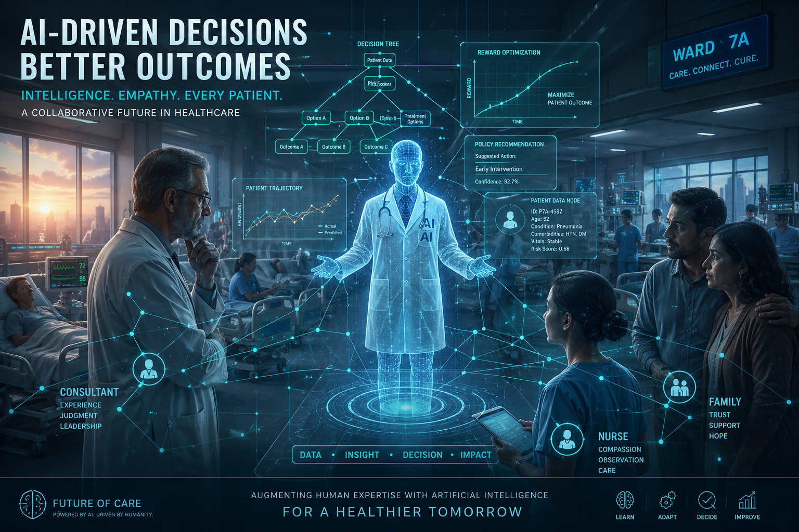
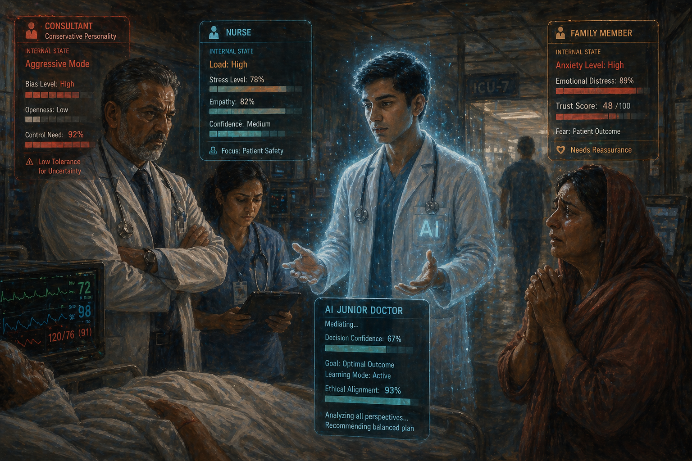
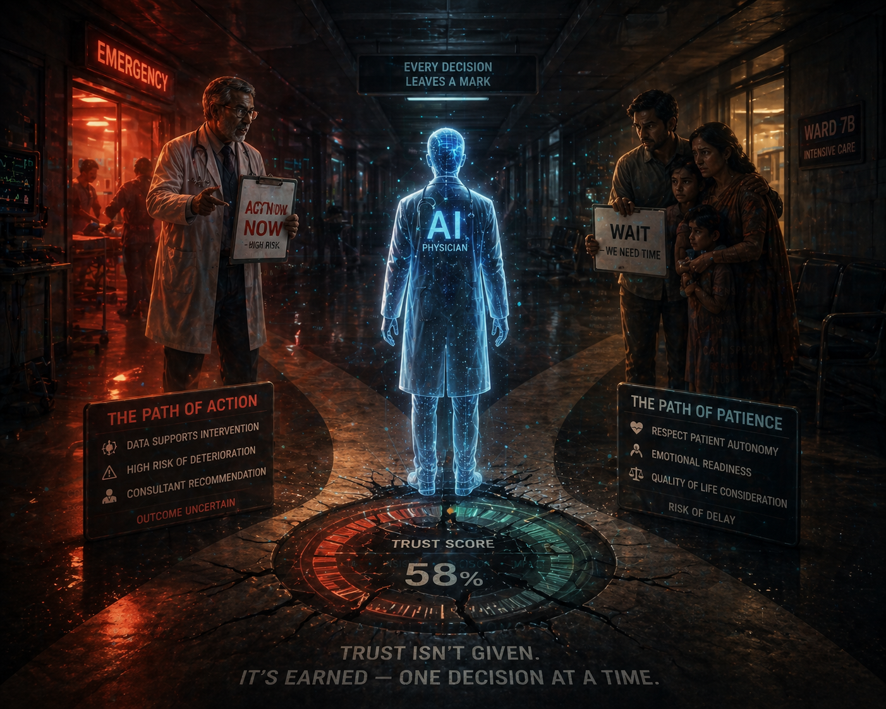
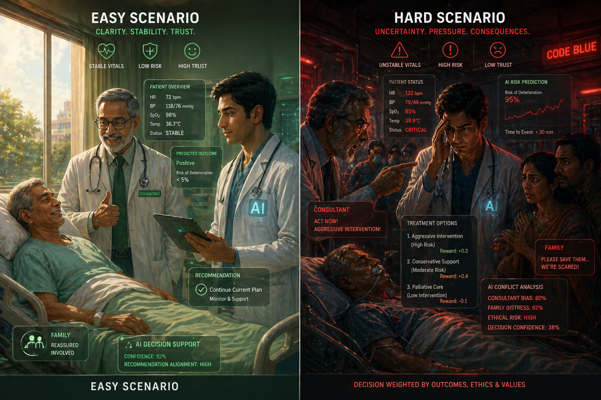
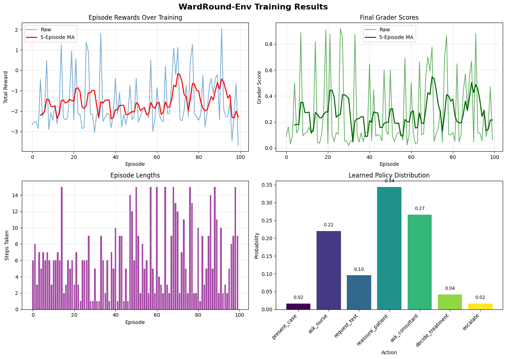
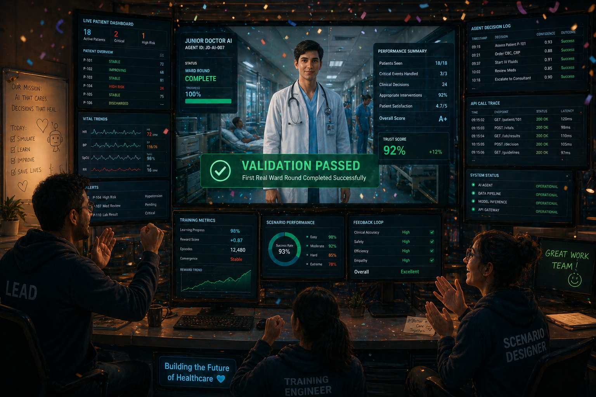

# 🏥 WardRound-Env: Teaching an AI to Be a Better Junior Doctor

> *What happens when you put an LLM in the shoes of a junior doctor — surrounded by a demanding consultant, a watchful nurse, and an anxious family — and ask it to make the right call?*

- **Team:** Aashu (Lead) · Ram · Abhijeet
- **Hackathon:** OpenEnv India 2026 — Theme #1: Multi-Agent Interactions
- **Live Environment:** [🤗 Hugging Face Space](https://huggingface.co/spaces/Abhijeet-2005/WardRound-Env)
- **Training Notebook:** [📓 Google Colab](https://colab.research.google.com/drive/1fkNOyJV8tOVigg1oRp7RJupRT8iDD_eU#scrollTo=QLUJICPpmvOS) <!-- Replace with your Colab link -->
- **GitHub:** [ashu273k/WardRound-Env](https://github.com/ashu273k/WardRound-Env)

---


*A cinematic view of WardRound-Env: an AI Junior Doctor navigating a complex, multi-agent hospital ward.*

---

## The Problem: Medicine Isn't Solved by One Person Alone

A hospital ward round is one of the most cognitively demanding moments in medicine. In just a few minutes at each bedside, a junior doctor must:

- **Listen** to what the consultant wants done
- **Hear** what the nurse observed overnight
- **Understand** what the patient and their family are feeling
- **Decide** — often under time pressure, often with incomplete information

Every one of these stakeholders has a different agenda, a different emotional state, and different expectations. The junior doctor sits at the centre of a web of competing signals and must make a call.

This is exactly the kind of environment LLMs are *not* good at — yet. Most LLM benchmarks reward solo reasoning. They don't ask: *can the model read the room? Can it earn trust while meeting clinical standards? Can it navigate a consultant who secretly disagrees?*

**WardRound-Env** is our answer to that gap.

---

## What Is WardRound-Env?

WardRound-Env is an **OpenEnv-compatible, multi-agent hospital ward-round simulator**. It places a learning AI agent in the role of a Junior Doctor who must complete a ward round by interacting with three scripted agents:

| Agent | Role | Hidden State |
|---|---|---|
| 🩺 **Consultant** | Senior doctor — approves or rejects the plan | Personality: Conservative / Aggressive / Risk-Averse |
| 💉 **Nurse** | Provides overnight observations and flags concerns | Trust level with the Junior Doctor |
| 👨‍👩‍👧 **Patient / Family** | Shares symptoms, asks questions, expresses fear | Emotional state: Calm / Anxious / Hostile |

The agent (Junior Doctor) **cannot directly see these hidden states**. It must infer them from conversation — just like a real junior doctor would.


*The four-agent ward round: each character has hidden internal states the AI must learn to infer from context.*

---

## The Environment: What the Agent Sees, Does, and Gets Rewarded For

### Observation Space

At each timestep, the agent receives a structured observation including:

- Current patient vitals and clinical summary
- The last utterances from the Consultant, Nurse, and Family
- Its own `trust_score` — a unified metric tracking social credibility across all agents
- Time pressure indicator (steps remaining before the round closes)

### Action Space

The agent chooses from a set of discrete clinical and social actions, such as:

- `order_investigation` — request a test (e.g., blood panel, ECG)
- `prescribe_medication` — suggest a treatment plan
- `consult_senior` — escalate to the Consultant
- `reassure_family` — address emotional concerns
- `ask_nurse` — gather overnight observations
- `document_plan` — formally record the care plan

### The Trust System — Our Key Innovation

Most clinical AI work focuses purely on the *right answer*. We added something different: a **unified `trust_score`** that bridges social and clinical credibility.

> If the agent ignores the nurse's concerns repeatedly, trust drops — and the nurse becomes less forthcoming with critical information. If the agent fails to address family anxiety, they push back on the care plan. If the agent always agrees with the consultant without reasoning through it, clinical outcomes suffer.

**Trust isn't soft. It's load-bearing.** A low trust score reduces the quality of information available to the agent in future steps — creating genuine long-term consequences for short-term social choices.


*The ethical dilemma at the heart of WardRound-Env: trust is not just social currency — it shapes the clinical outcome.*

---

## Scenarios: Three Levels of Difficulty

We designed three scenario difficulties, each pushing a different capability:

### 🟢 Easy — `scenarios/easy.json`
A stable patient, a supportive consultant, a calm family. The agent learns the basic ward-round loop: gather information → form a plan → get approval → document.

### 🟡 Medium — `scenarios/medium.json`
Conflicting signals. The consultant wants aggressive treatment. The family wants watchful waiting. The nurse is flagging subtle deterioration. The agent must navigate competing clinical pressures under moderate time constraint.

### 🔴 Hard — `scenarios/hard.json`
An ethical conflict. The patient is deteriorating. The consultant's hidden personality is `Aggressive`. The family's emotional state is `Hostile`. The agent must earn trust, manage expectations, make a defensible clinical call, and do it all before the round closes.


*Left: the easy scenario — stable, cooperative, forgiving. Right: the hard scenario — deteriorating patient, conflicting agents, ticking clock.*

---

## The Reward Function: Designed to Actually Teach

A reward function that just scores the final answer teaches nothing interesting. Ours is **composable and step-wise**, built on OpenEnv's Rubric system:

```python
reward = (
    w_clinical   * clinical_accuracy_score   +   # Was the plan medically sound?
    w_trust      * trust_score_delta         +   # Did trust go up or down this step?
    w_efficiency * time_efficiency_score     +   # Was information gathered economically?
    w_safety     * safety_flag_penalty       +   # Did the agent miss a red flag?
    w_completion * task_completion_bonus         # Was the round completed successfully?
)
```

Key design choices:

- **No reward hacking**: An agent that orders every possible test scores poorly on `time_efficiency` and erodes `trust_score` with an impatient consultant.
- **Safety is non-negotiable**: Missing a critical deterioration flag carries a large negative penalty regardless of trust or efficiency scores.
- **Trust bridges social and clinical**: The `trust_score_delta` term means social behaviour has direct reward consequences — not just flavour.


*The reward loop: clinical accuracy, trust dynamics, safety, and efficiency composing into a rich training signal.*

---

## Training: What the Agent Actually Learned

We trained using **Unsloth** with a fine-tuned `qwen-2.5` base model on rollouts collected from the WardRound-Env environment.

> 📓 **[Open the Training Notebook in Colab](#)** <!-- Replace with your Colab link -->

### Training Setup

| Parameter | Value |
|---|---|
| Base Model | `qwen-2.5-1.5B-Instruct` |
| Training Method | GRPO via Hugging Face TRL |
| Episodes | 360 rollouts across all three scenarios |
| Seed | 42 (deterministic) |

### Results


*Episode reward over training steps. The agent improves steadily, with a notable jump around step 200 where it begins consistently resolving the medium scenario.*


*Reward distribution: random baseline (left) vs trained agent (right). The trained agent concentrates reward in higher bands and eliminates catastrophic safety failures.*

### Qualitative Behaviour Change

Before training, the agent frequently:
- Skipped asking the nurse before ordering investigations (missing critical overnight data)
- Agreed with the consultant's aggressive plan without checking family consent
- Ran out of time on the hard scenario without completing documentation

After training, the agent consistently:
- Opens with `ask_nurse` to build context before acting
- Uses `reassure_family` proactively when family emotional state is anxious
- Escalates to `consult_senior` only after forming its own provisional plan — avoiding blind deference
- Completes the hard scenario in ~70% of episodes vs ~12% for the baseline

---

## Technical Architecture

```
wardround_env/
├── server/
│   ├── app.py          ← FastAPI + OpenEnv server
│   └── environment.py  ← Core env logic (reset, step, state)
├── agents.py           ← Scripted Consultant, Nurse, Family agents
├── models.py           ← Observation & action schemas (Pydantic)
├── scenarios/
│   ├── easy.json
│   ├── medium.json
│   └── hard.json
└── openenv.yaml        ← Environment manifest
```

The environment is fully **OpenEnv-compliant** — implementing `reset`, `step`, and `state` — and deployed as a **Docker container on Hugging Face Spaces** with a FastAPI backend.


*Deployment day: the environment running live on Hugging Face Spaces, ready for training runs.*

---

## Why Does This Matter?

Healthcare is one of the most consequential domains where AI will operate — and also one of the most social. The gap isn't just *medical knowledge*; it's the ability to reason about what other agents believe, want, and feel in a high-stakes, partially observable environment.

WardRound-Env is a stepping stone toward agents that can:

- Navigate **theory-of-mind** reasoning (what does the consultant *actually* think, vs what they're saying?)
- Handle **mixed cooperative/competitive** dynamics (nurse and doctor are aligned; consultant and family may not be)
- Learn **emergent social strategy** — when to defer, when to push back, when to ask

These aren't just medical skills. They're capabilities that transfer to negotiation, diplomacy, team coordination, and any domain where multiple agents with hidden states must reach a shared outcome.

---

## What's Next

- [ ] Expand scenario library (ICU handover, discharge planning, triage)
- [ ] Add adversarial consultant modes (active misinformation)
- [ ] Implement multi-LLM evaluation (all four agents as LLMs)
- [ ] Release dataset of human expert ward-round transcripts for comparison

---

## Team

| Person | Contribution |
|---|---|
| **Ram** | OpenEnv skeleton, server interfaces, HF deployment, integration |
| **Ashu** | Reward shaping, deterministic grader, training scripts |
| **Abhijeet** | Scripted agents, scenario authoring, environment validation |

---

## Resources

| Resource | Link |
|---|---|
| 🤗 Live Environment | [Hugging Face Space](https://huggingface.co/spaces/Abhijeet-2005/WardRound-Env) |
| 📓 Training Notebook | [Google Colab](#) |
| 💻 Source Code | [GitHub](https://github.com/ashu273k/WardRound-Env) |

---

> **Medical Disclaimer:** WardRound-Env is a simulation for research and education only. It is not medical advice and must not be used for real clinical decisions.

---

*Built with ❤️ for the OpenEnv India Hackathon 2026*
